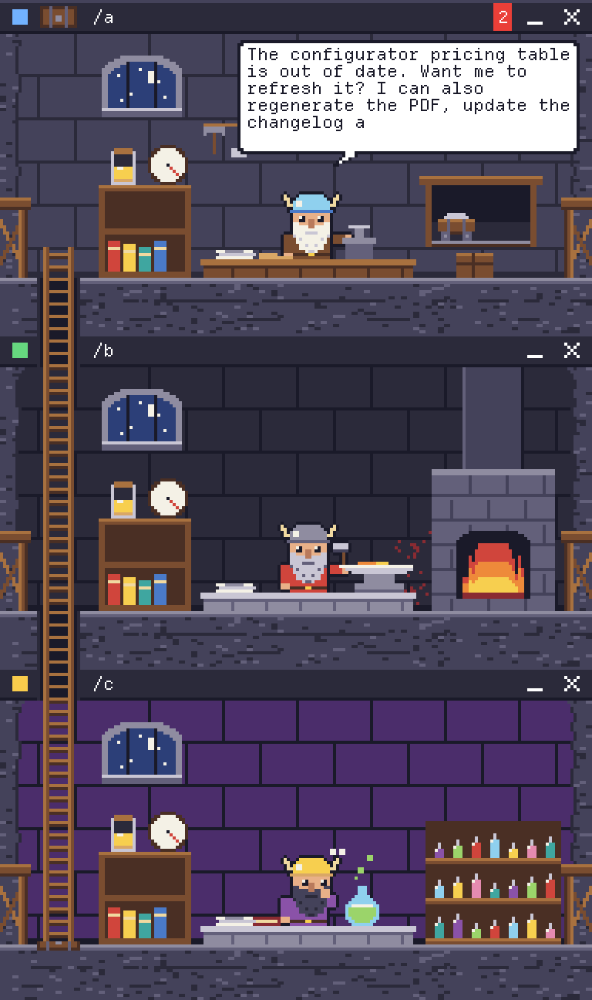

# Nook

Nook gives each of your Claude Code agents a small 8-bit pixel window docked in a corner of your
screen. Click one to make it active — the others dim and an input bar with the chat log appears at
the bottom of the screen. Nook has no API key and no account of its own: each window runs *your*
unmodified `claude` in a project folder you pick, so you can see what several agents are doing
without keeping several terminals in front of you. Native AppKit and SpriteKit, no dependencies.

<!-- TODO: screenshot of three docked agent windows with the chat panel open -->

## Requirements

- macOS 14 or later.
- **Claude Code installed and logged in** (`claude --version` should work). Without it the windows
  open and no agent ever answers.
- A Swift toolchain to build: Xcode, or `xcode-select --install`.

## Install

    curl -fsSL https://raw.githubusercontent.com/mikem3d/nook/main/scripts/install.sh | bash

This builds from source and installs `Nook.app` into `/Applications`. Re-run it to update; run
`scripts/uninstall.sh` to remove it. Full walkthrough, permission prompts and troubleshooting:
**[docs/INSTALL.md](docs/INSTALL.md)**.

The app is **not notarised**. Building locally sidesteps that entirely — a locally built app is not
quarantined, so it opens with no Gatekeeper prompt — but a downloaded release zip needs a trip to
System Settings › Privacy & Security › Open Anyway. Because builds are signed ad hoc, macOS also
re-asks for microphone, screen recording and notification permission after each update.

Nook has no Dock icon. Look for the menu bar icon and the `+` orb in a screen corner; **Settings…**
is in the menu bar icon's menu.

---

## Build and test

    swift build
    swift test

## Run

    scripts/run.sh --demo                      # three scripted agents, spends no usage
    scripts/run.sh ~/work/project-a ~/work/b   # one real agent per folder

`scripts/run.sh` bundles `dist/Nook.app` and opens it; arguments pass through. `swift run Nook …`
also works for everything except voice: macOS kills a process that asks for the microphone
without the usage strings in the bundle's Info.plist, so outside the bundle Nook refuses to ask.

| Flag or variable | Effect |
| --- | --- |
| `--demo` | Adds three scripted agents for tuning the window experience. |
| `<folder> …` | Opens an agent running `claude` in each folder. |
| `--say=<text>` | Sends an opening message to every real agent (engine smoke test). |
| `NOOK_LOG=1` | Prints every agent state change to stderr. |
| `NOOK_CONFIG=debug` | Makes `scripts/run.sh` build the debug configuration. |

`open` sends output to the system log. To see `NOOK_LOG` output, start the bundled binary directly:

    NOOK_LOG=1 dist/Nook.app/Contents/MacOS/Nook --demo

## Bundle

    scripts/bundle.sh [debug|release]     # default release -> dist/Nook.app

Builds, copies the binary and the SwiftPM resource bundle (`Contents/Resources/Nook_Nook.bundle`),
fills `Support/Info.plist` with the version from `VERSION`, draws the placeholder icon
(`scripts/make_icon.swift`), and signs ad-hoc with the hardened runtime and
`Support/Nook.entitlements` (microphone only). `NOOK_BUNDLE_ID` overrides the placeholder
identifier `dev.nook.app`; `NOOK_SIGN_ID` signs with a real identity.

An ad-hoc signature changes with every build, so macOS may ask for microphone and speech access
again after a rebuild. A stable signing identity avoids that.

`scripts/notarize.sh` does Developer ID signing, notarisation and stapling for distribution; its
header explains the one-time setup and the environment variables it needs.

## Continuous integration

`.github/workflows/build.yml` runs `swift build` and `swift test` on every push and pull request.
`.github/workflows/release.yml` builds, zips and attaches the app bundle to a GitHub Release when a
`v*` tag is pushed.

## Voice

Hold **⌃⌥V**, speak, release to send. Transcription happens on this Mac.

- "sternfall, run the tests" goes to the agent named sternfall, without focusing it. Names may be
  split ("zip demand …") and long names forgive one slip; anything less certain is not treated as
  a name.
- "everyone, …" or "all agents, …" goes to every agent.
- Anything else goes to the active agent, or the last one you used.
- "allow", "approve" or "deny" on its own answers the active agent's pending permission;
  "sternfall, allow" answers sternfall's.

| Preference (`defaults write dev.nook.app …`) | Meaning |
| --- | --- |
| `nook.hotkey.voice -string "control+option+v"` | The talk key: modifiers and one key joined by `+`. |
| `nook.voice.allowNetwork -bool true` | Allow Apple's servers when the language has no on-device model. Off by default. |
| `nook.voice.locale -string en-GB` | Recognition language; defaults to the system's. |
| `nook.voice.aliases -dict asche-kron '("ash crown")'` | Extra spoken names for labels the recogniser mangles. |

## Licence

Nook is MIT licensed — see [LICENSE](LICENSE).

Two things in this repository are not Nook's to license:

- **Departure Mono**, the pixel font in `Sources/Nook/Assets/fonts/`, is copyright 2022–2024
  Helena Zhang and licensed under the SIL Open Font License 1.1. Its licence travels with it in
  `DepartureMono-LICENSE.txt` and must stay with any copy you distribute.
- **Claude Code** is Anthropic's, and Nook neither includes nor redistributes it. Nook only starts
  the copy you installed and logged into yourself.
